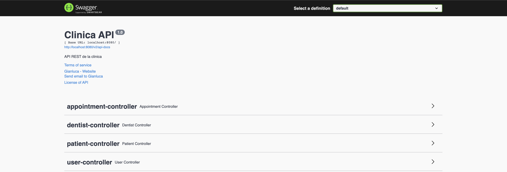
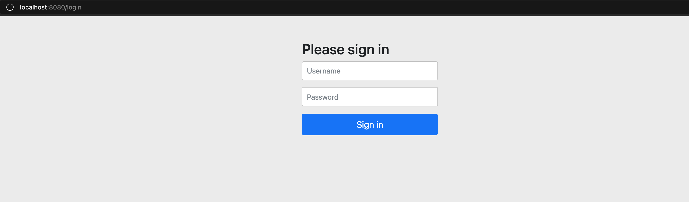

# Final project: Dental clinic for BackEnd-1 (ApiREST)
## Description
The project is a REST API of a dental clinic, where you can add, delete, update or list patients, dentists and appointments.

## How does it work?

Actually, much better if you just start the application and navigate to `http://localhost:8080/swagger-ui/`. There you'll find a nice API documentation thanks to Swagger.

## Endpoints

Once we have our application running, by default the application starts on port 8080, we enter from the web to `http://localhost:8080`.

## Roles 

To log in as an administrator, we must log in with the credentials: Username: `admin`, password : `admin`. We can manage all dentists, patients and appointments.

To enter as a user, we must enter with the credentials: Username: `user`, password : `user`. We can only access to modify the shifts.

